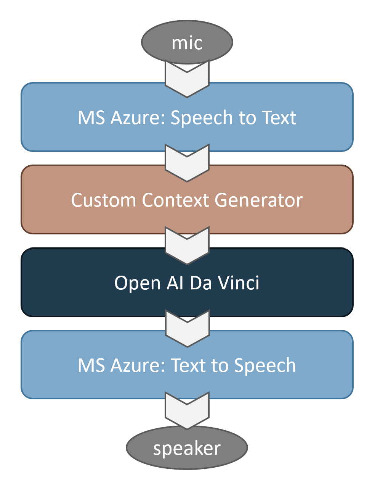

# Chat-Socrates
Conversational mobile application for learning and open discussion with Chat GPT

## Project Description

This repository uses Open AI's Da Vinci as core engine for general Q&A in the
style of Socrates. The intent of this project is providing users with the
ability to hold conversations while driving.

Imagine a world where you can chat about any topic while driving, and learn
on the specifics of what you find interesting? That world starts with Chat Socrates.
More personalized than a podcast, and yet with access to the powers of large
Natural Language models.

## Technologies Used

- Open AI's Da Vinci, Large Language Model.
- Azure Cognitive's Speech to Text.
- Azure Cognitive's Text to Speech.

## Project Pipeline

1. your microphone is used to record the question you want to ask Socrates.
2. Azure Cognitive parses the audio to text.
3. Text is used to create the context* needed based on previous interactions.
4. Open AI's Da Vinci receives the question & context, then answers in the style of Socrates.
5. Azure Cognitive parses the text back to audio and plays it through your speakers.

### Project Pipeline: Context Generation

Generating context so Socrates can recall your previous interactions throughout your
conversation is no trivial task.

Our current implementation has the following steps:
- Memory steps:
  - Each new Q&A is added to a CSV (up to 500 tokens).
  - Along with the Q&A, an embedding is generated based on its tokens.
- For each new question asked by the user to Socrates:
  - Embedding is computed for the new question.
  - Cosine similarity function is run between the question and all the past Q&A pairs.
  - Most relevant past Q&A pairs are added up to 1,800 tokens total as context for Socrates.

